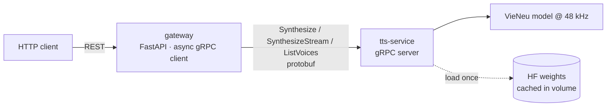

# VieNeu TTS API — FastAPI + gRPC + Docker

A Vietnamese text-to-speech API built on [VieNeu-TTS](https://github.com/pnnbao97/VieNeu-TTS),
split into two processes:

- **`tts-service`** — a gRPC server that loads the VieNeu model once and does inference.
- **`gateway`** — a FastAPI HTTP facade that talks to the worker as a gRPC *client* and
  exposes an ElevenLabs-compatible REST surface.

**Why two processes?** The model is heavy and stateful; the web tier is light and
stateless. Splitting them lets you scale each independently (one gateway × N workers),
transfer audio as raw protobuf bytes, and map VieNeu's `infer_stream` onto a
server-streaming RPC. The gRPC contract (`protos/tts.proto`) is the boundary.

## Architecture



## Project layout

```
tts-api/
├── protos/tts.proto            # shared gRPC contract
├── scripts/gen_protos.sh       # generates Python stubs into <service>/app/generated
├── docker-compose.yml          # wires the two services together
├── Makefile                    # proto / up / down / logs helpers
├── .env.example
├── tts_service/                # gRPC worker
│   ├── Dockerfile
│   ├── requirements.txt
│   └── app/
│       ├── server.py           #   gRPC server + health + reflection
│       ├── engine.py           #   VieNeu adapter (only model-specific code)
│       ├── voices.py           #   voice_id catalog + id↔name resolution
│       ├── audio.py            #   resampling (soxr) + WAV/MP3 encoding (lameenc)
│       ├── config.py
│       └── healthcheck.py
└── gateway/                    # FastAPI gateway
    ├── Dockerfile
    ├── requirements.txt
    └── app/
        ├── main.py             #   REST endpoints
        ├── grpc_client.py      #   async gRPC client (one long-lived channel)
        ├── schemas.py
        └── config.py
```

## Run

```bash
cp .env.example .env
docker compose up --build
```

> ⚠️ First boot downloads the VieNeu weights from Hugging Face into the `hf-cache`
> volume — it can take several minutes. The gateway waits for the worker's gRPC
> health check to report `SERVING` (`start_period: 300s`) before accepting traffic.

Gateway is then on <http://localhost:8600> — interactive docs at `/docs`.

## Endpoints

| Method | Path                            | Body / Params                                   | Returns        |
|--------|---------------------------------|-------------------------------------------------|----------------|
| GET    | `/health`                       | —                                               | `{"status"}`   |
| GET    | `/v1/voices`                    | —                                               | voice list     |
| POST   | `/v1/text-to-speech/{voice_id}` | `{text, style?, denoise?}` · `?output_format=`  | `audio/mpeg`*  |
| POST   | `/v1/tts`                       | `{text, voice?, style?, denoise?}` · `?output_format=` | `audio/wav`* |
| POST   | `/v1/tts/clone`                 | multipart `text`, `ref_audio`, `denoise?`       | `audio/wav`    |
| POST   | `/v1/tts/stream`                | `{text, voice?, style?}`                        | PCM f32 stream |

\* Content-Type follows `output_format`. `/v1/text-to-speech/{voice_id}` defaults to
`mp3_44100_128` (ElevenLabs default); `/v1/tts` defaults to `wav`.

### Examples

```bash
# ElevenLabs-style: voice id in the path, MP3 out by default
curl -X POST http://localhost:8600/v1/text-to-speech/pham-tuyen \
  -H 'Content-Type: application/json' \
  -d '{"text":"Xin chào, đây là VieNeu."}' \
  --output speech.mp3

# Explicit format (sample rate + bitrate)
curl -X POST "http://localhost:8600/v1/text-to-speech/ngoc-tran?output_format=mp3_22050_64" \
  -H 'Content-Type: application/json' -d '{"text":"..."}' --output speech.mp3

# Simple body form — voice = id OR name; style optional; WAV by default
curl -X POST http://localhost:8600/v1/tts \
  -H 'Content-Type: application/json' \
  -d '{"text":"Xin chào.","voice":"thai-son","style":"doc_truyen"}' \
  --output speech.wav

# List voices
curl http://localhost:8600/v1/voices

# Voice cloning — 3-8s reference clip
curl -X POST http://localhost:8600/v1/tts/clone \
  -F text="Giọng nói được nhân bản." \
  -F ref_audio=@my_voice.wav \
  --output cloned.wav
```

The `/v1/tts/stream` response is headerless little-endian float32 @ 48 kHz
(`X-Audio-Format: pcm_f32le`); reassemble client-side, e.g. `np.frombuffer(data, np.float32)`.

## Voices

There are **two independent sources** of voice identity:

1. **Presets** — 14 fixed, curated voices, addressed by `voice_id`.
2. **Cloning** — *unlimited*: any 3–8s `ref_audio` clip defines a voice at runtime
   (via `/v1/tts/clone`), described by a speaker embedding rather than an id.
   **Requires torch + torchaudio** — the speaker encoder that turns a clip into an
   embedding is torch-based, so the default torch-free image supports presets only.
   Enable it via the commented block in `tts_service/requirements.txt`.

`style` is an **orthogonal axis** (a delivery mode), not a voice: `tu_nhien` (natural),
`tin_tuc` (news), `doc_truyen` (storytelling). Each preset ships with a default style
but you can override it per request.

### Preset catalog

| `voice_id`    | Name        | Gender | Region | Default style |
|---------------|-------------|--------|--------|---------------|
| `minh-duc`    | Minh Đức    | male   | Bắc    | tin_tuc       |
| `pham-tuyen`  | Phạm Tuyên  | male   | Bắc    | tu_nhien      |
| `thai-son`    | Thái Sơn    | male   | Nam    | doc_truyen    |
| `xuan-vinh`   | Xuân Vĩnh   | male   | Nam    | tu_nhien      |
| `thanh-binh`  | Thanh Bình  | male   | Bắc    | doc_truyen    |
| `truc-ly`     | Trúc Ly     | female | Bắc    | tu_nhien      |
| `ngoc-linh`   | Ngọc Linh   | female | Bắc    | doc_truyen    |
| `doan-trang`  | Đoan Trang  | female | Bắc    | tu_nhien      |
| `mai-anh`     | Mai Anh     | female | Bắc    | tin_tuc       |
| `thuc-doan`   | Thục Đoan   | female | Nam    | doc_truyen    |
| `minh-triet`  | Minh Triết  | male   | Nam    | tin_tuc       |
| `thuy-dung`   | Thùy Dung   | female | Nam    | tin_tuc       |
| `quang-son`   | Quang Sơn   | male   | Trung  | tu_nhien      |
| `ngoc-tran`   | Ngọc Trân   | female | Trung  | tu_nhien      |

Distribution: 7 male / 7 female · Bắc 7 · Nam 5 · Trung 2. This table is generated
data — `GET /v1/voices` is the source of truth at runtime.

### Custom (cloned) voices

You can turn a cloned voice into a permanent, addressable voice — same footing as a
preset. Enrolling encodes a reference clip **once** into a speaker embedding + codes
stored in `tts_service/app/data/custom_voices.json`; after that the voice:

- appears in `GET /v1/voices` with `"category": "cloned"`,
- is usable by its `voice_id` everywhere (REST, `/v1/text-to-speech/{id}`, JSON-RPC),
- is served **torch-free** — the embedding is precomputed, so no reference clip (and
  no torch) is needed at synthesis time. Only *enrolling* needs torch + torchaudio.

The repo ships with these cloned voices already enrolled in `custom_voices.json`
(usable out of the box, no torch required):

| `voice_id`  | Name     | Gender | Region  | Default style | Notes                          |
|-------------|----------|--------|---------|---------------|--------------------------------|
| `gia-bao`   | Gia Bảo  | male   | Bắc     | tu_nhien      | dẫn tin công nghệ (cloned)     |
| `jessica`   | Jessica  | female | English | tu_nhien      | English female voice (cloned)  |

Enroll your own with the script below:

```bash
# ref clip should be a clean 3-8s wav
python examples/enroll_voice.py --ref clip.wav --name "Sora Narrator" \
    --gender male --region "Bắc" --style tu_nhien --description "..."
# -> id=sora-narrator ; then:  POST /v1/text-to-speech/sora-narrator
```

### Voice identity

VieNeu keys presets by human name (`"Phạm Tuyên"`) with no opaque id. The worker
derives a stable, URL-safe **`voice_id`** slug from each name (`pham-tuyen`), so it can
live in a URL path. `GET /v1/voices` returns an ElevenLabs-shaped payload:

```json
{
  "voices": [
    {
      "voice_id": "pham-tuyen",
      "name": "Phạm Tuyên",
      "category": "premade",
      "description": "Nam · Bắc · Phong cách tự nhiên",
      "labels": { "gender": "male", "accent": "Bắc", "style": "tu_nhien" }
    }
  ]
}
```

Both the `voice_id` slug and the raw `name` are accepted wherever a voice is expected;
the worker resolves either back to VieNeu's name-key. An unknown voice → HTTP 400.

## Output formats

Both synthesis endpoints accept an `output_format` query param (ElevenLabs-style):

| `output_format`         | Content-Type | Notes                                     |
|-------------------------|--------------|-------------------------------------------|
| `mp3_44100_128`         | `audio/mpeg` | ElevenLabs default; resampled 48k→44.1k   |
| `mp3` / `mp3_48000_128` | `audio/mpeg` | native 48 kHz, no resample                |
| `mp3_<sr>_<kbps>`       | `audio/mpeg` | any sample rate + bitrate                 |
| `wav`                   | `audio/wav`  | PCM_16                                     |

The model is natively **48 kHz**; any other rate is produced by high-quality resampling
(`soxr`). MP3 is encoded with LAME (`lameenc`) in the worker — no system `ffmpeg` needed.
All container/codec logic lives in `tts_service/app/audio.py`.

## LucyLab-compatible JSON-RPC API

A drop-in layer for tools written against [LucyLab](https://lucylab.io) (single
JSON-RPC endpoint, async job + polling, audio delivered as a URL). Additive — the
REST API above still works.

```
POST /json-rpc      {jsonrpc:"2.0", method, input, id}  →  {jsonrpc, id, result|error}
GET  /files/{id}    the generated audio (audio/wav)
```

| `method`          | `input`                          | `result`                                            |
|-------------------|----------------------------------|-----------------------------------------------------|
| `ttsLongText`     | `{text, userVoiceId, speed}`     | `{projectExportId, characterCount, blockCount}`     |
| `getExportStatus` | `{projectExportId}`              | `{jobId, state, url, srtUrl, error}`                |
| `getUserVoices`   | `{limit, page}`                  | `{items:[{id,name,isActive}], total}`               |

`state` ∈ `pending · processing · completed · failed`; `url` is populated once
`completed`. `speed` is accepted (only `1.0` is a no-op today — see limitations).
`srtUrl` is always `null` (see limitations).

### Wiring the Auto-Create-Video tool

Point its LucyLab config at this gateway — no code change:

```
TTS_PROVIDER=lucylab
LUCYLAB_ENDPOINT=http://localhost:8600/json-rpc
VIETNAMESE_VOICEID=pham-tuyen          # any voice_id from GET /v1/voices
VIETNAMESE_API_KEY=anything            # auth is disabled for now
```

### Limitations vs the real LucyLab

- **No auth** (currently). Every request is accepted regardless of `Authorization`.
- **`srtUrl` = null.** VieNeu emits no timestamps; subtitles would need forced
  alignment. The Auto-Create-Video pipeline tolerates this (its ElevenLabs provider
  has no SRT either).
- **`speed` ignored** beyond `1.0`. Changing speed needs pitch-preserving
  time-stretch — deferred.
- **In-memory jobs.** Single gateway process only; jobs are lost on restart.

## Configuration

Environment variables (see `.env.example`). Worker vars are read by `tts_service`,
gateway vars by `gateway`.

### Worker (`tts-service`)

| Variable             | Default      | Meaning                                   |
|----------------------|--------------|-------------------------------------------|
| `TTS_BACKEND`        | `onnx`       | `onnx` (CPU, torch-free) or `torch` (GPU) |
| `TTS_PRECISION`      | `fp32`       | onnx backend only                         |
| `TTS_DEFAULT_VOICE`  | `Phạm Tuyên` | used when a request omits voice + ref     |
| `TTS_DEFAULT_STYLE`  | `tu_nhien`   | `tu_nhien` \| `tin_tuc` \| `doc_truyen`   |
| `TTS_SAMPLE_RATE`    | `48000`      | native model rate                         |
| `TTS_GRPC_PORT`      | `50051`      | gRPC listen port                          |
| `TTS_MAX_WORKERS`    | `4`          | gRPC thread pool (see scaling note)       |
| `TTS_MAX_MESSAGE_MB` | `64`         | max gRPC message size                     |

### Gateway (`gateway`)

| Variable                   | Default             | Meaning                       |
|----------------------------|---------------------|-------------------------------|
| `GATEWAY_TTS_GRPC_TARGET`  | `tts-service:50051`     | worker address                       |
| `GATEWAY_REQUEST_TIMEOUT`  | `120`                   | per-request gRPC timeout (s)         |
| `GATEWAY_MAX_MESSAGE_MB`   | `64`                    | max gRPC message size                |
| `GATEWAY_HOST_PORT`        | `8600`                  | host port published (container: 8000)|
| `GATEWAY_PUBLIC_BASE_URL`  | `http://localhost:8600` | base for the JSON-RPC audio `url`    |
| `GATEWAY_FILES_DIR`        | `/tmp/tts-files`        | where generated audio is written     |

## GPU

The default image uses VieNeu's torch-free ONNX/CPU backend. For CUDA:

1. Base the `tts_service` image on an NVIDIA CUDA runtime and install
   `torch`/`torchaudio`/`transformers` per the VieNeu README.
2. Set `TTS_BACKEND=torch` in `.env`.
3. Uncomment the `deploy.resources` GPU block in `docker-compose.yml`.

## Operational notes

- **Scaling:** inference is *serialized* per worker via a lock (one model instance /
  device processes one clip at a time). To raise throughput, run multiple worker
  **replicas** behind the gateway rather than increasing `TTS_MAX_WORKERS`.
- **Debugging:** the worker exposes gRPC **health** and **reflection**. Publish port
  `50051` and use `grpcurl -plaintext localhost:50051 list`.
- **Single point of change:** the VieNeu call surface lives entirely in
  `tts_service/app/engine.py`; if the upstream API shifts, that is the only file to touch.

## Local development

```bash
# Regenerate gRPC stubs into both services (needs grpcio-tools)
pip install grpcio-tools
make proto

make up      # docker compose up -d
make logs    # follow logs
make down    # stop
```
